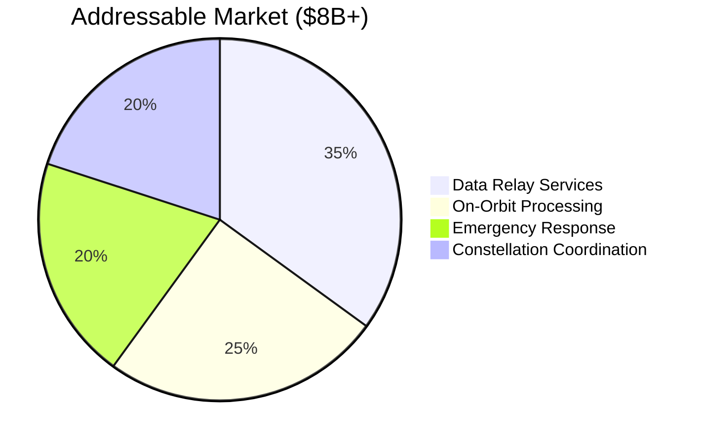

## Market Opportunity

### The Payment Rails for Space

**Market Drivers:**
- 10,000+ satellites by 2030
- Inter-operator coordination needed
- No existing payment infrastructure
- Regulatory framework emerging

**Competitive Advantage:**
- Open protocol → become the standard
- First-mover in trustless settlement
- Bitcoin-native (global, permissionless)
