## Resilience in Contested Environments

### No Pre-Shared Secrets | No Ground Coordination Required

```mermaid
flowchart TB
    subgraph denied["GROUND COORDINATION DENIED"]
        direction LR
        X1["✕"]
        X2["✕"]
        X3["✕"]
    end

    subgraph space["Space Operations"]
        direction LR
        A(("Friendly<br/>Sat A"))
        B(("Coalition<br/>Sat B"))
        C(("Commercial<br/>Sat C"))
        A <-->|"SISL"| B
        B <-->|"SISL"| C
    end

    A -.-> X1
    B -.-> X2
    C -.-> X3

    style denied fill:#2d1f1f,stroke:#f85149
    style A stroke:#58a6ff
    style B stroke:#3fb950
    style C stroke:#d29922
```

**No Pre-Shared Secrets**: X3DH enables first-contact auth between satellites that never met

**Byzantine Fault Tolerant**: Adaptor signatures ensure atomic task-payment binding

**Coalition Interoperable**: Works across operators without key pre-distribution
