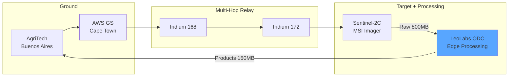

## Agricultural Monitoring

### Multi-Hop Relay + Orbital Processing

**Delegation Chain:**
- Each hop validates and extends capability token
- Final token authorizes Sentinel-2C imaging

**Products:** NDVI, NDRE, NDWI crop stress maps

**Latency:** 3h 50m (vs 6+ hours traditional)
