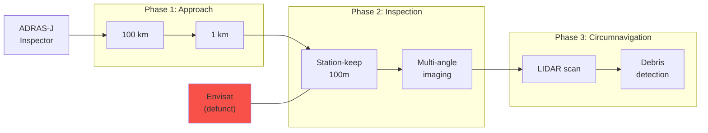

## Space Debris Inspection

### Rendezvous and Proximity Operations

**Capability Token Constraints:**
- Min approach: 30m
- Max relative velocity: 0.1 m/s
- Abort triggers: velocity, attitude, debris impact

**Results:**
- 23 debris objects detected within 500m
- 3D LIDAR model at 5cm resolution
- Recent fragmentation event identified

**Value:** Prevent Kessler syndrome cascade
