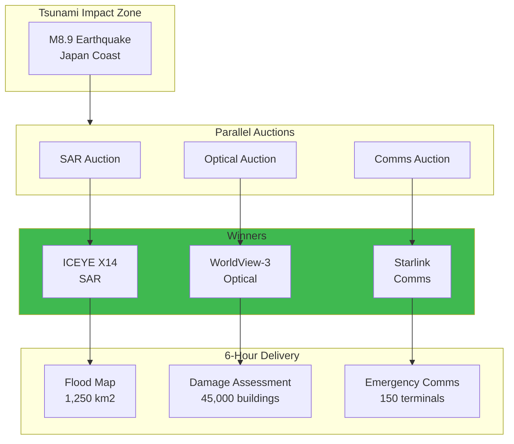

## Multi-Constellation Disaster Response

### Distributed Auction for Tsunami Response

**Auction Convergence:** 30 minutes

**vs Traditional:** 12+ hours coordination

**Products delivered:** 6 hours post-event
