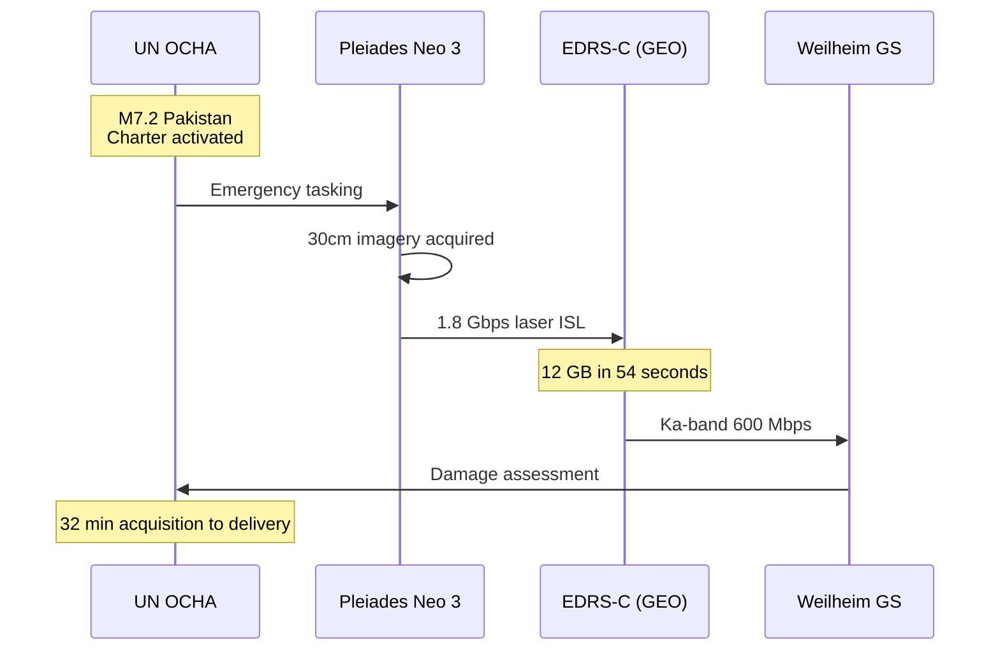

## Earthquake Response

### GEO Relay for Rapid Imagery

**Without GEO Relay:** 95 minutes (next ground pass)

**With EDRS:** 32 minutes

**Time Saved:** 63 minutes in the "golden hour"

**Damage Assessment:**
- 45,230 buildings analyzed
- 1,823 destroyed
- Critical infrastructure status
