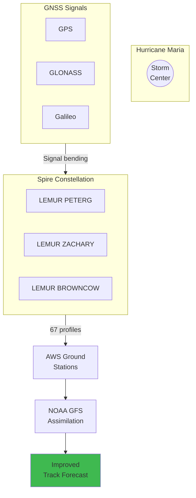

## Hurricane Forecasting

### GNSS Radio Occultation Coordination

**Atmospheric Profiling:**
- 67 occultation profiles in 6-hour window
- Surface to 40km altitude
- All-weather (works through clouds)

**Forecast Impact:**
| Horizon | Track Improvement |
|---------|-------------------|
| 24 hr | 18 km |
| 48 hr | 35 km |
| 72 hr | 52 km |
