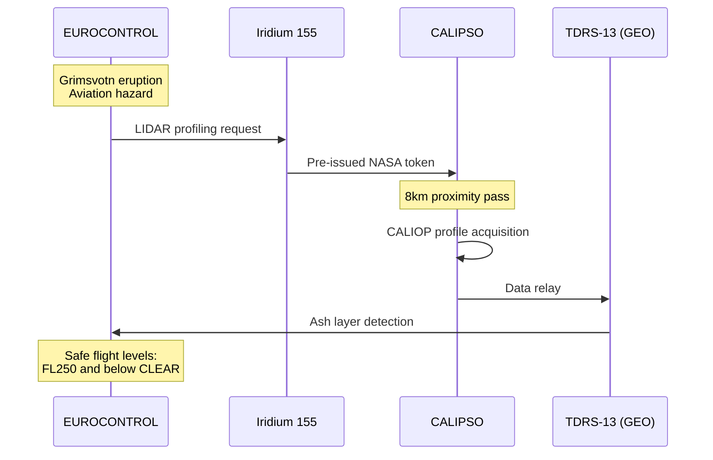

## Volcanic Ash Detection

### Cross-Operator LIDAR via Iridium

**Cross-Operator Agreement:**
- NASA pre-issues tokens to Iridium
- Emergency atmospheric hazard authorization
- EUROCONTROL, FAA, ICAO authorized requestors

**Latency:** 1h 45m (vs 3+ hours ground pass)
