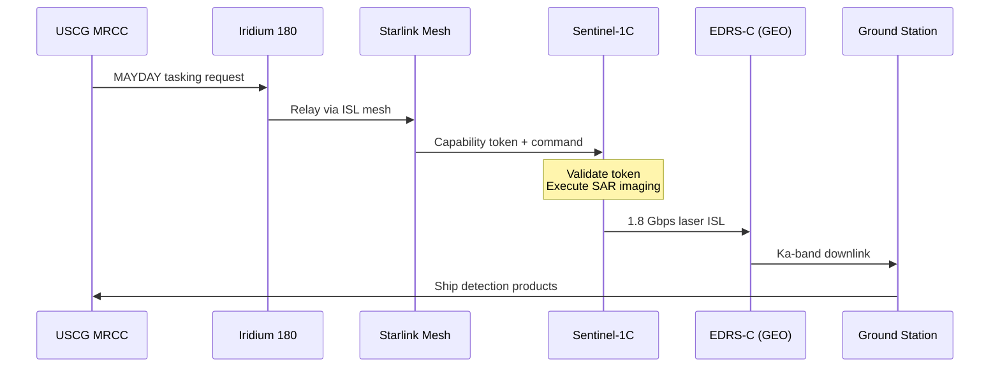

## Emergency Maritime SAR

### 12-Minute Response via Starlink Relay

**Key Metrics:**
| Traditional | With SCRAP |
|-------------|-----------|
| 47 min wait | 12 min total |
| Ground pass required | ISL relay |

> **Value**: Lives saved through faster maritime response
