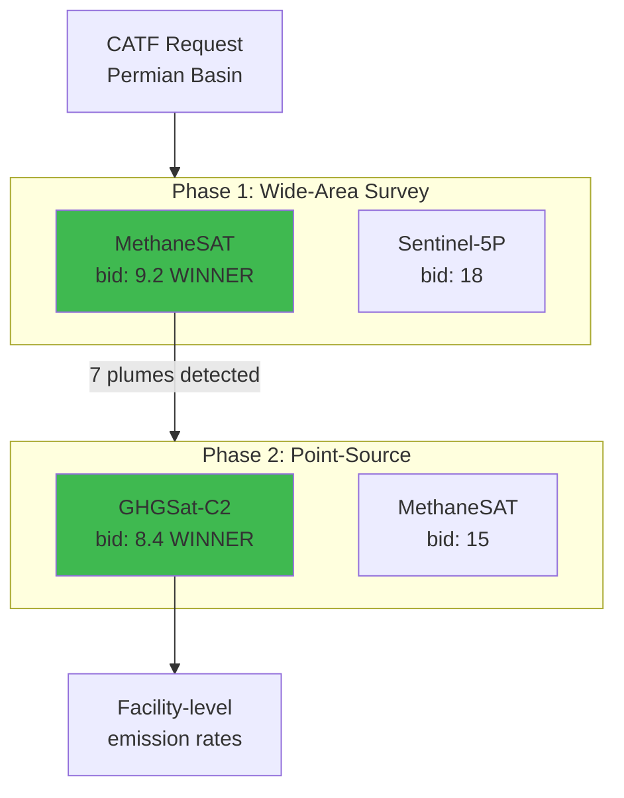

## Methane Super-Emitter Detection

### Two-Phase Auction: Survey + Quantification

**Complementary Sensors:**
| Phase | Winner | Resolution | Detection |
|-------|--------|------------|-----------|
| Survey | MethaneSAT | 400m | >100 kg/hr |
| Quantify | GHGSat | 25m | >20 kg/hr |

**Output:** 15,200 kg/hr emissions from 7 super-emitters

**Timeline:** 4 hours (vs days of manual coordination)
