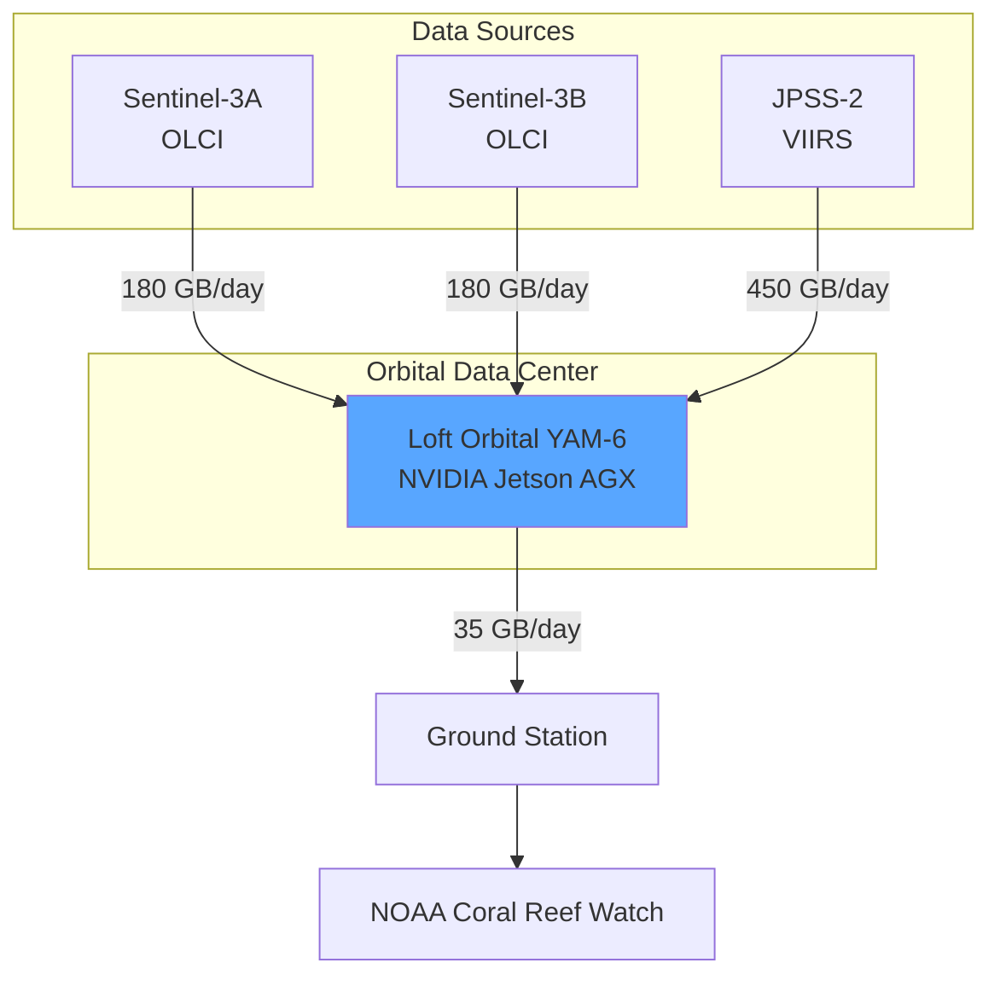

## Orbital Data Processing

### 95% Downlink Reduction via Edge Computing

**Processing Pipeline (in orbit):**
1. Atmospheric correction
2. Ocean color derivation
3. SST calculation
4. Multi-sensor fusion
5. Anomaly detection

**Data Reduction:**
| Stage | Traditional | Orbital |
|-------|-------------|---------|
| Downlink | 810 GB | 35 GB |
| Latency | 24+ hours | 6.5 hours |

**Output:** Coral bleaching alerts 4x faster
