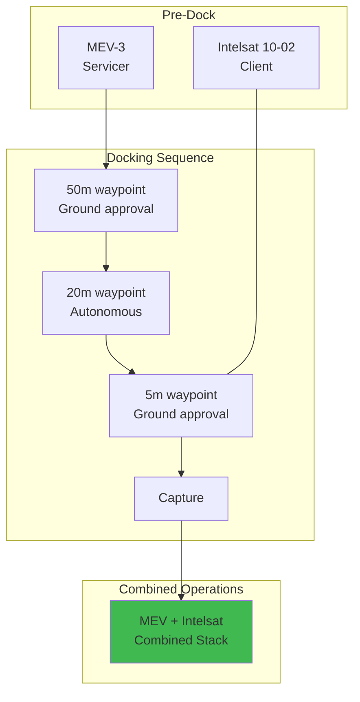

## Satellite Life Extension

### MEV Docking via Capability Tokens

**Docking Authorization Token:**
- Contact velocity: < 0.05 m/s
- Interface: LAE nozzle capture ring
- Abort conditions: attitude, velocity, anomaly

**Life Extension:**
| Metric | Value |
|--------|-------|
| Original EOL | 2025-06 |
| Extended EOL | 2030-01 |
| Revenue preserved | $180M |
