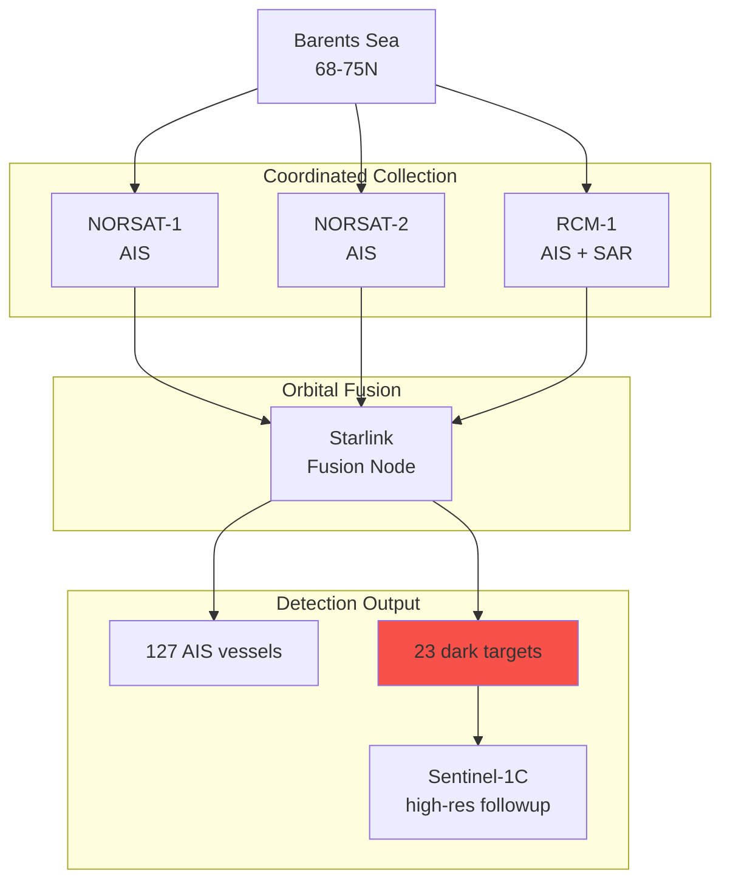

## Maritime Domain Awareness

### Multi-Satellite AIS + SAR Fusion

**Dark Shipping Detection:**
- AIS-only: 127 vessels transmitting
- SAR-only: 23 vessels (AIS disabled)
- Automatic high-res tasking for identification

**Coverage:** 94% AOI in 6-hour window
