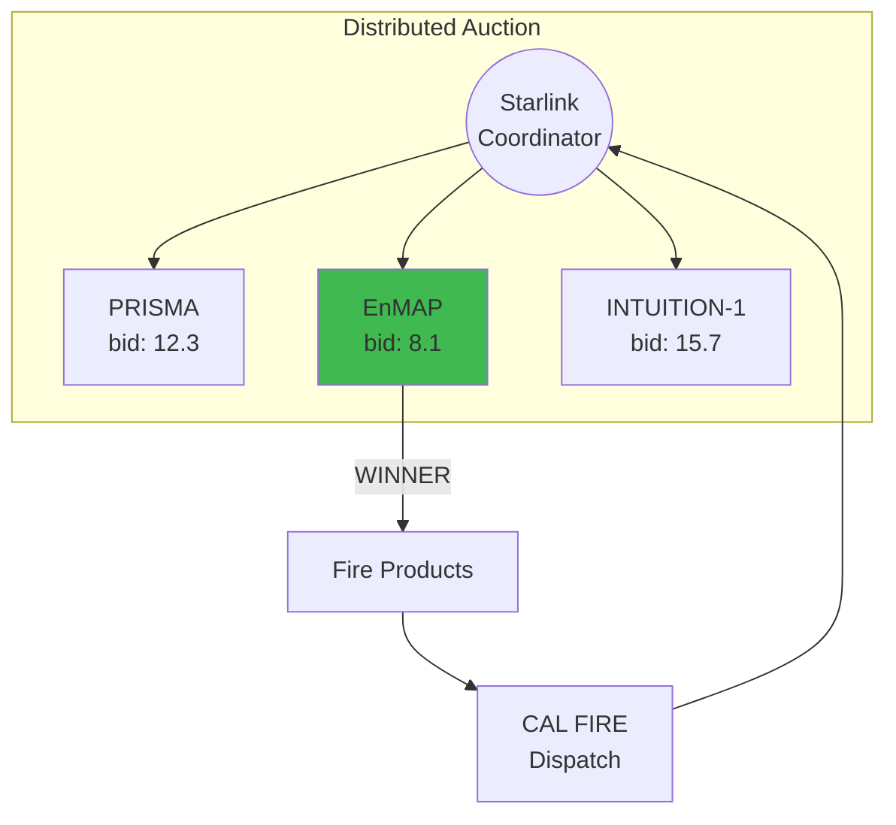

## Wildfire Monitoring

### Hyperspectral Imaging via Auction

**Auction Selects Optimal Satellite:**
- Lowest bid (best position + capability)
- EnMAP: Earlier access, full SWIR coverage
- Products: Fire mask, burn severity, fuel type

**Timeline:** 4 hours from request to delivery
