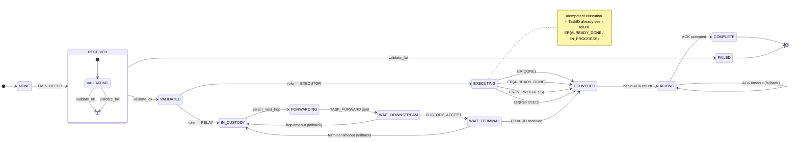
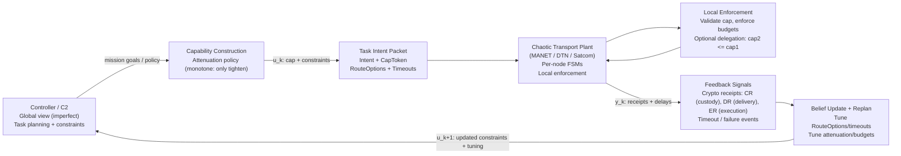

# SCRAP Task Routing State Machine

## Overview
This document defines the per-node, per-task state machine used by SCRAP/SISL
to provide reliable task delivery and acknowledgement over unreliable,
chaotic transports (MANET, DTN, satellite links).

## Design Goals
- Deterministic local behavior
- Multi-path fallback routing
- Cryptographically verifiable execution
- Bounded retries and authority
- Transport-agnostic operation

## Task Lifecycle State Machine

## Control Loop with Capability Attenuation

